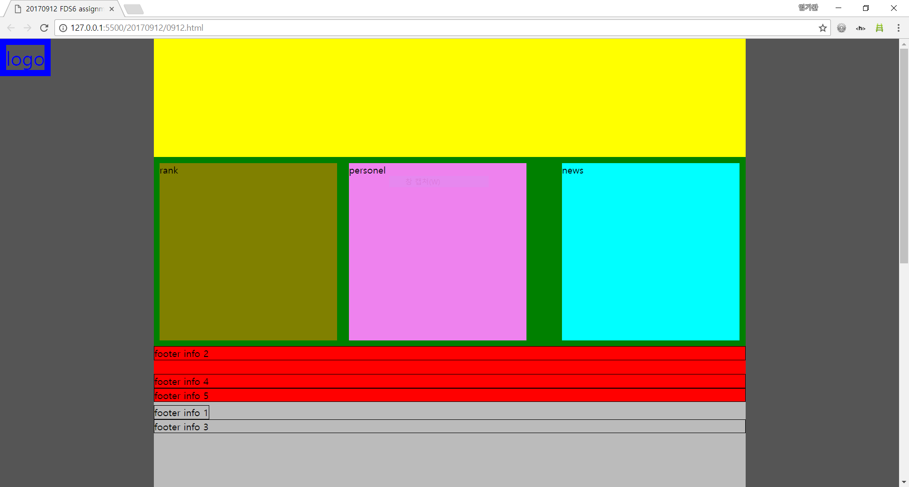
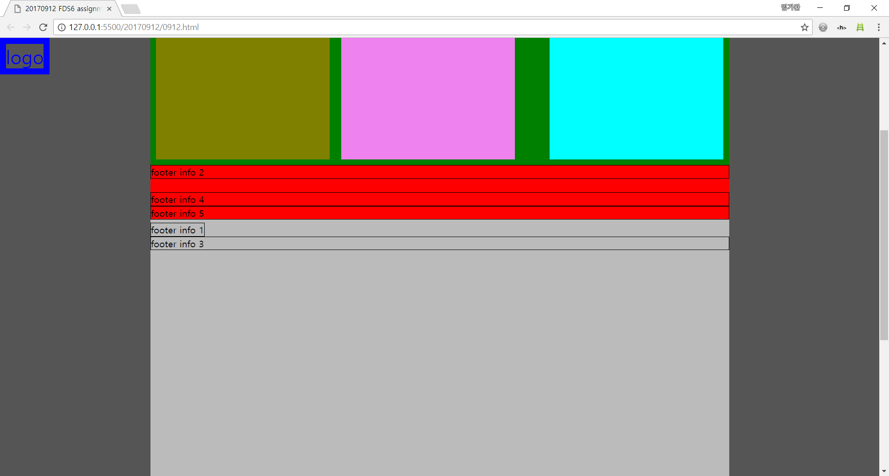

# FDS6_assign
FDS6기를 위한 과제 할당 repo

## 20170912 과제 설명

이 repository의 20170912 directory에 오늘의 과제가 들어있습니다.
20170912/0912.html을 browser에서 열었을 때 아래 그림과 같이 보이도록 만드는 것이 오늘의 과제입니다.

두번째 그림은 왼쪽 상단의 파란색 "LOGO"가 scrolling에 상관 없이 항상 왼쪽 상단에 떠있음을 보이고 있습니다.

이 과제의 제약은 다음과 같습니다.

1. 0912.html의 mark-up 구조를 바꾸지 말아야함.
1. 0912.css에서 빠진 부분을 추가해야 함.

참고로 20170912.7z에는 이 과제의 해답 css 파일이 암호화되어 들어있습니다.
적절한 시기에 공개하도록 하겠습니다.